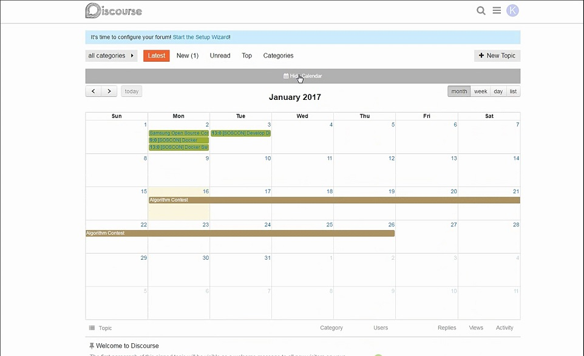
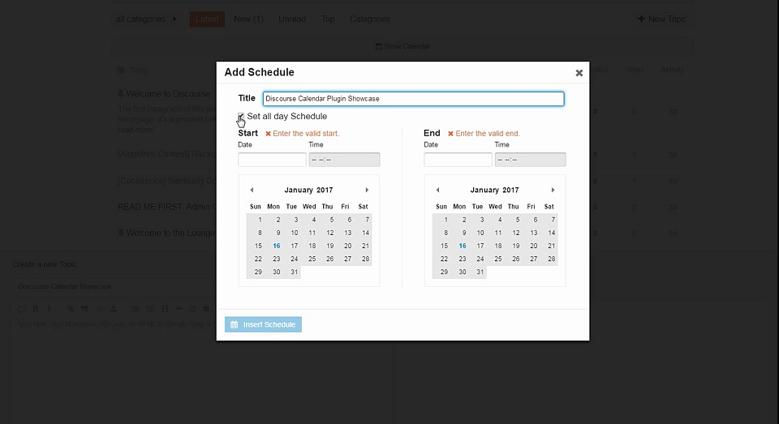
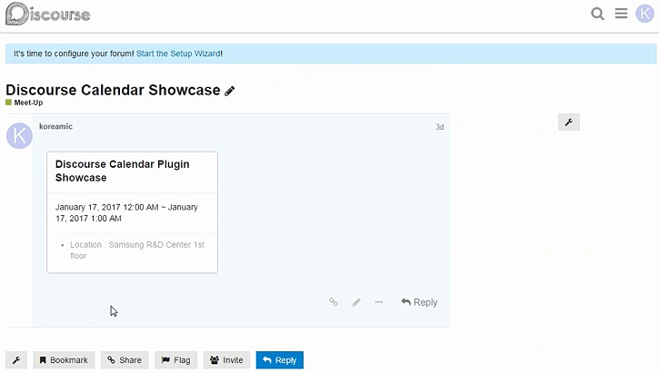

# Discourse Calendar Plugin

This plug-in allows users to register schedules and check it easily through calendar views.

# Screen Shots
- **Calendar view**


- **Modal popup for adding schedule**


- **Schedule detail view**


- **If want more details, See discourse-calendar.mp4**

# Features
- Users can register schedules in any post.
- Using calendar view, Users can show schedules.
- The calendar can be viewed monthly, weekly, and daily.
- Users can register all day schedule or specific time schedule.
- Users can register one or more schedules in a post.
- Users can enter extra contents about a schedule.

# Develop with
- calendar library(https://fullcalendar.io/, https://github.com/fullcalendar/fullcalendar.git)
- card ui library(http://semantic-ui.com/, https://github.com/Semantic-Org/Semantic-UI.git)

# Installation
- clone plugin sources in discourse/plugins directory
```
$ git clone https://github.com/koreamic/discourse-calendar.git
```
- execute datebase migration
```
$ bundle exec rake db:migrate RAILS_ENV=[production or development or test]
```
- if nessesary, execute assets precompile
```
$ bundle exec rake assets:precompile RAILS_ENV=production
```
- start server and enjoy calendar plugin.

# TODO
- Add various calendar options in plugin setting.
  - header menu : year....

# License

 MIT
